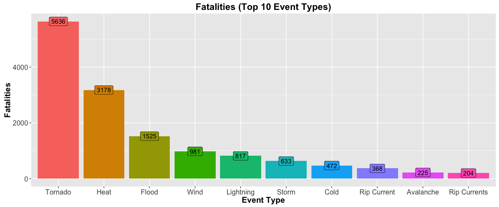
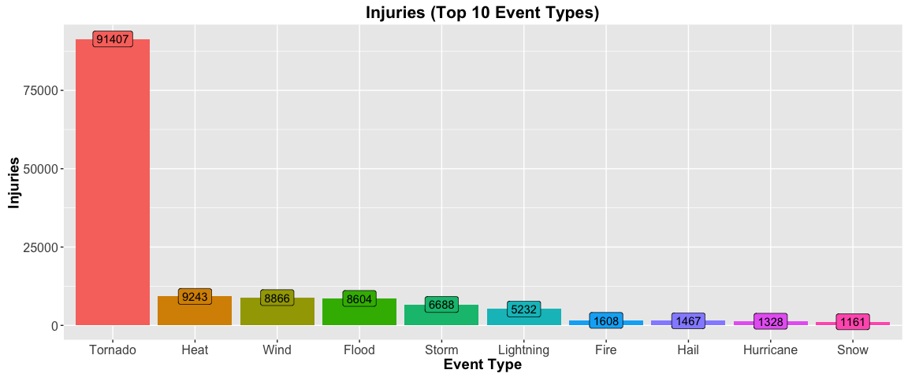

# Impact of Storm On Population Health and Economy

# Synopsis

Storms and other severe weather events can cause both public health and economic problems for communities and municipalities. Many severe events can result in fatalities, injuries, and property damage, and preventing such outcomes to the extent possible is a key concern.

This project involves exploring the U.S. National Oceanic and Atmospheric Administration's (NOAA) storm database. This database tracks characteristics of major storms and weather events in the United States, including when and where they occur, as well as estimates of any fatalities, injuries, and property damage.

Our project aims to answer the following questions:  
1. Across the United States, which types of events are most harmful with respect to population health?  
2. Across the United States, which types of events have the greatest economic consequences?  

# Data Processing  

* Configure our document settings  
* Load the necessary packages required for our analysis   
* Validate our environment setup  


```r
knitr::opts_chunk$set(
  cache=TRUE
  ,fig.path="figure/"
  ,fig.width=12
  )

setwd("/Users/bradychiu/Dropbox (Uber Technologies)/R/Coursera/05_Reproducible_Research/Assignment2/PeerAssessment2")

library(dplyr,warn.conflicts=F)
library(ggplot2,warn.conflicts=F)
library(lubridate,warn.conflicts=F)
library(knitr,warn.conflicts=F)
library(tidyr,warn.conflicts=F)
library(tools)

sessionInfo()
```

```
## R version 3.2.4 (2016-03-10)
## Platform: x86_64-apple-darwin13.4.0 (64-bit)
## Running under: OS X 10.11.4 (El Capitan)
## 
## locale:
## [1] en_US.UTF-8/en_US.UTF-8/en_US.UTF-8/C/en_US.UTF-8/en_US.UTF-8
## 
## attached base packages:
## [1] tools     stats     graphics  grDevices utils     datasets  methods  
## [8] base     
## 
## other attached packages:
## [1] tidyr_0.4.1     knitr_1.12.3    lubridate_1.5.0 ggplot2_2.1.0  
## [5] dplyr_0.4.3    
## 
## loaded via a namespace (and not attached):
##  [1] Rcpp_0.12.3      digest_0.6.9     assertthat_0.1   plyr_1.8.3      
##  [5] grid_3.2.4       R6_2.1.2         gtable_0.2.0     DBI_0.3.1       
##  [9] formatR_1.2.1    magrittr_1.5     scales_0.4.0     evaluate_0.8    
## [13] stringi_1.0-1    rmarkdown_0.9.2  stringr_1.0.0    munsell_0.4.3   
## [17] yaml_2.1.13      parallel_3.2.4   colorspace_1.2-6 htmltools_0.3
```

* Download source data file and load  


```r
if(!dir.exists("data/")) dir.create("data/")
if(!file.exists("data/storm.bz2")) download.file("https://d396qusza40orc.cloudfront.net/repdata%2Fdata%2FStormData.csv.bz2","data/storm.bz2")
storm_data<-read.csv("data/storm.bz2",stringsAsFactors=F)
colnames(storm_data)<-tolower(names(storm_data))
```

* Filter for data that is relevant to our analysis  
* Map exponents of property and crop damage to numeric values  
* Clean up event type names  


```r
storm_data_clean<-storm_data %>%
  dplyr::select(evtype,fatalities,injuries,propdmg,propdmgexp,cropdmg,cropdmgexp) %>%
  filter(fatalities>0 | injuries>0 | propdmg>0 | cropdmg>0) %>%
  mutate(
    evtype=tolower(evtype)
    ,propdmgexp=ifelse(propdmgexp=="K",3,propdmgexp)
    ,propdmgexp=ifelse(propdmgexp=="M",6,propdmgexp)
    ,propdmgexp=ifelse(propdmgexp=="B",9,propdmgexp)
    ,propdmgexp=as.numeric(ifelse(!is.numeric(propdmgexp),0,propdmgexp))
    ,cropdmgexp=ifelse(cropdmgexp=="K",3,cropdmgexp)
    ,cropdmgexp=ifelse(cropdmgexp=="M",6,cropdmgexp)
    ,cropdmgexp=ifelse(cropdmgexp=="B",9,cropdmgexp)
    ,cropdmgexp=as.numeric(ifelse(!is.numeric(cropdmgexp),0,cropdmgexp))
    ,propdmg=propdmg*(10^propdmgexp)
    ,cropdmg=cropdmg*(10^cropdmgexp)
    ,evtype=gsub(".*avalance.*","avalanche",evtype,ignore.case=T)
    ,evtype=gsub(".*blizzard.*","blizzard",evtype,ignore.case=T)
    ,evtype=gsub(".*cold.*","cold",evtype,ignore.case=T)
    ,evtype=gsub(".*freez.*","cold",evtype,ignore.case=T)
    ,evtype=gsub(".*frost.*","cold",evtype,ignore.case=T)
    ,evtype=gsub(".*hypothermia.*","cold",evtype,ignore.case=T)
    ,evtype=gsub(".*fire.*","fire",evtype,ignore.case=T)
    ,evtype=gsub(".*flood.*","flood",evtype,ignore.case=T)
    ,evtype=gsub(".*fog.*","fog",evtype,ignore.case=T)
    ,evtype=gsub(".*hail.*","hail",evtype,ignore.case=T)
    ,evtype=gsub(".*heat.*","heat",evtype,ignore.case=T)
    ,evtype=gsub(".*warm.*","heat",evtype,ignore.case=T)
    ,evtype=gsub(".*hurricane.*","hurricane",evtype,ignore.case=T)
    ,evtype=gsub(".*landslide.*","landslide",evtype,ignore.case=T)
    ,evtype=gsub(".*lightning.*","lightning",evtype,ignore.case=T)
    ,evtype=gsub(".*ligntning.*","lightning",evtype,ignore.case=T)
    ,evtype=gsub(".*mud.*slide.*","mudslide",evtype,ignore.case=T)
    ,evtype=gsub(".*precip.*","rain",evtype,ignore.case=T)
    ,evtype=gsub(".*rain.*","rain",evtype,ignore.case=T)
    ,evtype=gsub(".*shower.*","rain",evtype,ignore.case=T)
    ,evtype=gsub(".*snow.*","snow",evtype,ignore.case=T)
    ,evtype=gsub(".*storm.*","storm",evtype,ignore.case=T)
    ,evtype=gsub(".*tornado.*","tornado",evtype,ignore.case=T)
    ,evtype=gsub(".*torndao.*","tornado",evtype,ignore.case=T)
    ,evtype=gsub(".*wind.*","wind",evtype,ignore.case=T)
    ,evtype=gsub("\\?","other",evtype,ignore.case=T)
    ) %>%
  group_by(evtype) %>%
  summarize(
    fatalities=sum(fatalities)
    ,injuries=sum(injuries)
    ,propdmg=sum(propdmg)
    ,cropdmg=sum(cropdmg)
    ,econdmg=sum(propdmg,cropdmg)
    ) %>%
  data.frame()
```

# Analysis

* We analyze our data to get number of fatalities by event type  


```r
ggplot(
  storm_data_clean %>%
    filter(fatalities>0) %>%
    top_n(10,fatalities) %>%
    mutate(
      evtype=toTitleCase(evtype)
      ,evtype=factor(evtype,levels=evtype[order(fatalities,decreasing=T)])
      )
  ,aes(x=evtype,y=fatalities,fill=evtype)
  )+
  geom_bar(stat="identity")+
  ggtitle("Fatalities (Top 10 Event Types)")+
  geom_label(aes(label=fatalities))+
  scale_fill_discrete(name="Event Type")+
  scale_x_discrete(name="Event Type")+
  scale_y_continuous(name="Fatalities")+
  theme(
    plot.title=element_text(face="bold",size=16)
    ,axis.title=element_text(face="bold",size=14)
    ,axis.text=element_text(size=12)
    ,legend.text=element_text(size=10)
    ,strip.text=element_text(size=12)
    )
```



* We analyze our data to get number of injuries by event type  


```r
ggplot(
  storm_data_clean %>%
    filter(injuries>0) %>%
    top_n(10,injuries) %>%
    mutate(
      evtype=toTitleCase(evtype)
      ,evtype=factor(evtype,levels=evtype[order(injuries,decreasing=T)])
      )
  ,aes(x=evtype,y=injuries,fill=evtype)
  )+
  geom_bar(stat="identity")+
  ggtitle("Injuries (Top 10 Event Types)")+
  geom_label(aes(label=injuries))+
  scale_fill_discrete(name="Event Type")+
  scale_x_discrete(name="Event Type")+
  scale_y_continuous(name="Injuries")+
  theme(
    plot.title=element_text(face="bold",size=16)
    ,axis.title=element_text(face="bold",size=14)
    ,axis.text=element_text(size=12)
    ,legend.text=element_text(size=10)
    ,strip.text=element_text(size=12)
    )
```



* We analyze our data to get economic cost of property and crop damage by event type  


```r
ggplot(
  storm_data_clean %>%
    filter(econdmg>0) %>%
    top_n(10,econdmg) %>%
    mutate(
      evtype=toTitleCase(evtype)
      ,evtype=factor(evtype,levels=evtype[order(econdmg,decreasing=T)])
      ) %>%
    dplyr::select(evtype,propdmg,cropdmg) %>%
    gather(dmgtype,econdmg,-evtype) %>%
    arrange(evtype,dmgtype)
  ,aes(x=evtype,y=econdmg,fill=dmgtype)
  )+
  geom_bar(stat="identity",position="stack")+
  ggtitle("Econoimc Damage (Top 10 Event Types)")+
#   geom_label(aes(
#     x=evtype
#     ,y=econdmg
#     ,label=paste("$",format(round(econdmg,0),big.mark=",",trim=T),sep="")
#     ))+
  scale_fill_discrete(
    name="Event Type"
    ,labels=c("Crop Damage","Property Damage")
    )+
  scale_x_discrete(name="Event Type")+
  scale_y_continuous(
    name="Economic Damage ($MM)"
    ,breaks=seq(0,10000000,1000000)
    ,labels=format(seq(0,10,1),big.mark=",",trim=T)
    )+
  theme(
    plot.title=element_text(face="bold",size=16)
    ,axis.title=element_text(face="bold",size=14)
    ,axis.text=element_text(size=12)
    ,legend.text=element_text(size=10)
    ,strip.text=element_text(size=12)
    )
```


# Results  

Our analysis shows the following:  

1. Across the United States, which types of events are most harmful with respect to population health?  

> __Tornados__ and __Heat__ cause the most fatalities and injuries  

2. Across the United States, which types of events have the greatest economic consequences?  

> __Tornados__ and __Floods__ cause the most economic damage  
